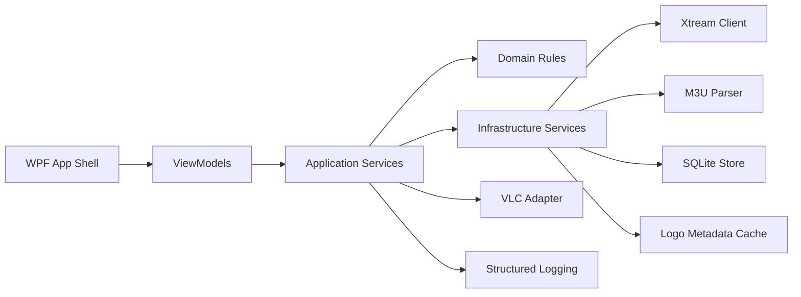

# Windows IPTV Player Architecture Plan

## 1. Product intent
Build a premium Windows IPTV desktop application focused on speed, playback stability, and polished UX.

Primary outcomes:
- Fast startup and fast channel switching
- Reliable VLC based playback
- Smooth handling of large channel catalogs
- Clear account status including expiration when available
- Production ready structure for iterative growth

## 2. Recommended tech stack for fastest stable delivery

### Core platform
- **Language and runtime:** C# with .NET 8
- **Desktop UI:** WPF
- **Player engine:** LibVLCSharp with native VLC runtime

Why this stack:
- WPF gives mature desktop performance, strong tooling, and low delivery risk
- LibVLCSharp is proven for codec coverage and stream compatibility
- .NET 8 provides modern performance, diagnostics, and long term maintainability

### Architecture and app model
- MVVM with feature oriented modules
- Clean separation of UI, application services, domain models, and infrastructure
- Async first data and playback pipelines to keep UI thread responsive

### Persistence and data
- SQLite for local persistence
- Lightweight ORM approach with Dapper for low overhead SQL access
- JSON cache manifests for transient metadata where useful

### Networking and resilience
- HttpClientFactory for pooled HTTP usage
- Timeout, retry, and backoff policies for catalog calls
- Circuit breaker style guards for unstable endpoints

### Logging and diagnostics
- Serilog with rolling file logs
- Structured events for playback, source auth, parsing, and UI actions
- User friendly error surfaces mapped from internal error codes

### Optional but recommended
- MemoryCache for hot metadata
- Disk cache for logos and parsed playlist snapshots
- Fluent icon pack and refined typography for premium visual language

## 3. Proposed solution structure

```text
IPTV-PLAYER/
  plans/
    iptv-player-architecture-plan.md
  src/
    IptvPlayer.App/                     # WPF startup, composition root, app shell
    IptvPlayer.Presentation/            # Views, ViewModels, UI behaviors, theming
    IptvPlayer.Application/             # Use cases, orchestration, DTO mapping
    IptvPlayer.Domain/                  # Core entities, value objects, business rules
    IptvPlayer.Infrastructure/          # HTTP clients, parsers, persistence, caching, logging
    IptvPlayer.Player.Vlc/              # VLC adapter, playback lifecycle, event bridge
    IptvPlayer.Contracts/               # Shared interfaces and contracts
  tests/
    IptvPlayer.UnitTests/
    IptvPlayer.IntegrationTests/
  build/
    packaging/
```

## 4. Module boundaries

- **Presentation**
  - Main three column shell
  - Source import and account switcher
  - Category list, channel list, search, favorites, recents
  - Player container and overlay controls

- **Application**
  - Source onboarding workflows
  - Playlist and category loading pipelines
  - Channel switch workflow with cancellation and state transitions
  - Last session restore workflow

- **Domain**
  - Entities: SourceAccount, Playlist, Category, Channel, ProgramItem, PlaybackState
  - Rules: favorite toggling, recent history constraints, expiration status derivation

- **Infrastructure**
  - Xtream API client and mappers
  - M3U and M3U8 parsing services
  - SQLite repositories
  - Cache provider for logos and metadata
  - Logging and telemetry adapters

- **Player.Vlc**
  - Media source preparation
  - Buffering and playback event handling
  - Recoverable error policy and fallback transitions
  - Fullscreen coordination hooks

## 5. High level architecture flow



## 6. Core screens and premium UX specification

### A. Source hub and import screen
- Cards for Xtream login, M3U URL, M3U file, M3U8 link
- Inline validation and connection test states
- Saved sources list with quick switch and status chips
- Account information panel with expiration date and days remaining when available

### B. Main shell three column layout
- **Left column**
  - Source selector and account summary
  - Category list with fast filtering
  - Sticky selected state, keyboard navigation, smooth scrolling

- **Middle column**
  - Channel list virtualized for large catalogs
  - Row content: logo, name, optional now playing text, favorite icon
  - Instant search and quick filter
  - Single click to play immediately

- **Right column**
  - Embedded player viewport with premium dark chrome
  - Loading and buffering indicators
  - Overlay controls with timed auto hide
  - Double click and escape fullscreen flow

### C. Supporting states
- Skeleton loading states for categories and channels
- Empty states for no data and no search matches
- Error states with clear cause and recovery action

## 7. Playback and resilience design

Channel switch state machine:
1. Cancel prior switch request
2. Show loading overlay
3. Resolve stream URL and headers
4. Start VLC media with options tuned for latency
5. Observe buffering and first frame event
6. Transition to playing or recoverable error

Recovery behavior:
- Auto retry with bounded attempts for transient network failures
- Fast fail for auth errors
- UI remains interactive during failures
- Playback failures logged with source id and channel id

## 8. Data model and persistence plan

Persisted tables:
- Sources
- Playlists
- Categories
- Channels
- Favorites
- Recents
- AppState
- CacheIndex

Key persisted state:
- Last selected source
- Last selected category per source
- Last played channel per source
- User preferences such as theme and keybinds

Expiration handling:
- Xtream: parse expiration from API response when present
- Store normalized UTC expiration timestamp
- Derive days remaining at display time
- If unavailable, present status as Not provided

## 9. Performance strategy

- Virtualized lists with recycling in category and channel panels
- Background parse and incremental UI hydration
- Debounced search with in memory index
- Logo lazy loading with memory and disk cache tiers
- Cancellation tokens for category changes and channel switches
- Strict UI thread budget: no blocking IO on dispatcher thread

## 10. Error handling and observability

- Error taxonomy: network, auth, parse, playback, persistence
- Map technical exceptions to user readable messages
- Correlated log context per request and playback session
- Diagnostic panel in settings with log file path and export option

## 11. Security and privacy baseline

- Store credentials encrypted using Windows DPAPI
- Never log passwords or full auth tokens
- Validate and sanitize all imported text inputs
- Respect local only operation with no cloud dependency

## 12. Implementation roadmap with acceptance criteria

### Phase 1: Project architecture and stack setup
- Create solution and projects based on module boundaries
- Configure DI, logging, configuration, and app bootstrap
- Acceptance: app launches with shell host and logging active

### Phase 2: Core window layout and navigation shell
- Implement premium dark theme and three column layout
- Wire basic navigation and placeholder view models
- Acceptance: responsive shell with keyboard navigation baseline

### Phase 3: VLC integration and embedded player
- Add VLC host control and lifecycle adapter
- Implement loading overlay and fullscreen interactions
- Acceptance: local sample and network stream playback stable

### Phase 4: Xtream authentication and parsing
- Implement Xtream login flow and account metadata mapping
- Parse categories, channels, and expiration details
- Acceptance: successful source import with persisted account data

### Phase 5: M3U and M3U8 import and parsing
- URL and local file import workflows
- Parse groups and channels robustly with fallback handling
- Acceptance: large playlists load without UI blocking

### Phase 6: Category and channel loading system
- Incremental data loading and virtualization
- Selection driven channel loading and immediate playback start
- Acceptance: fast category switch and low stutter list interaction

### Phase 7: Search, favorites, recents, persistence
- Add instant search index
- Add favorites and recents with persistence
- Restore last session state on startup
- Acceptance: state survives restart and remains consistent

### Phase 8: Expiration and account status UI
- Add account status badges and expiration panel
- Show missing expiration as transparent status
- Acceptance: clear status display for all source types

### Phase 9: Performance optimization
- Tune startup path, cache hydration, and playback switch latency
- Add profiling passes and fix hotspots
- Acceptance: measurable improvements across startup and switch flows

### Phase 10: UI polish and production hardening
- Refine motion, spacing, typography, iconography
- Add robust error boundaries and recovery UX
- Prepare packaging and release checklist
- Acceptance: production ready quality gate passed

## 13. Build start sequence for next mode

Immediate execution order for Code mode:
1. Scaffold solution and all projects
2. Implement composition root and app shell frame
3. Deliver phase 2 three column layout with placeholder data
4. Integrate VLC adapter and embed player control
5. Add import workflows then data providers in incremental phases

This plan is optimized for fast delivery without sacrificing maintainability, stability, or premium UX quality.
